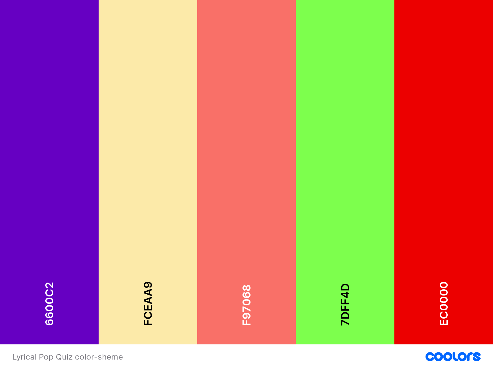

# **Lyrical Pop Quiz**

## **Code Institute Portfolio Project II**

## **Background**
I love music and specially singing along to it. No matter if under the shower, in the car or whenever a good lyric just gets me. People around me would probably say I’m quite good with lyrics but when put to a test I can confidently say, this is not the case. Often, we use the words we think are the lyrics but if checked mostly it just sound similar. 
If you want to know how good your lyrical knowledge of popular songs is then this is the perfect game for you! 

## **Contents**
* [Background](#background)
* [Strategy](#strategy)
* [Scope](#scope)
* [User Experience UX](#user-experience-ux)
    * [Target audience](#target-audience)
    * [User Stories](#user-stories)
* [Wireframes](#wireframes)
* [Design Choices](#design-choices)
    * [Color Palette](#color-palette)
    * [Typography](#typography)

## **Strategy**
Everybody loves singing along to their favorite song but how much of the lyrics do we actually know? In *Lyrical Pop Quiz* everybody can put their lyrical knowledge to the test. 

## **Scope**
The Scope of this project is creating a website with the HTML,CSS and JavaScript framework. The site’s users can play an online quiz to test their specific knowledge of pop song lyrics. The features include creating a username, tracking the score and and a countdown timer. 

## **User Experience UX**

### **Target Audience**

This game is designed for everybody who enjoys pop music and would like to test if they can gues the right lyric. 

### **User Stories**

- As a First Time User
    -	I can see the name and logo of the quiz application.
    - I can find instructions on how to play the game. 
    -	I can see a timer that shows how much time is left to play the game. 
    -	I can see the questions and three answer options.
    -	I can see how many answers I got right or wrong. 

- User Goals 
    -	To be able to play the quiz app on a selected range of device sizes.
    -	To be able to enter a username of my choice. 
    -	To be able to see the remaining time. 
    -	To be able to put my lyrical knowledge to test with help of multiple choice. 

## **Wireframes**

The wireframes where created using Figma.

Homepage:

Section for entering username:

Game play section:

Result section:

How to play page:

## **Design Choices**
### **Color Palette**

The idea behind the color palette was reflecting the mood of a 90's pop art comic with its vibrant and contrasting colors. 

### **Typography**

The Fonts used is [Bungee](https://fonts.google.com/specimen/Bungee) and [Martel](https://fonts.google.com/specimen/Martel). Bungee is a typeface that celebrates the urban sign. Martel is a libre font development project. Bungee being bold and round reminded me of somehting playfull and comic-like. This is why I choose the font. I used Martel on the rules page to make it more readable and underline the less playful information. 

