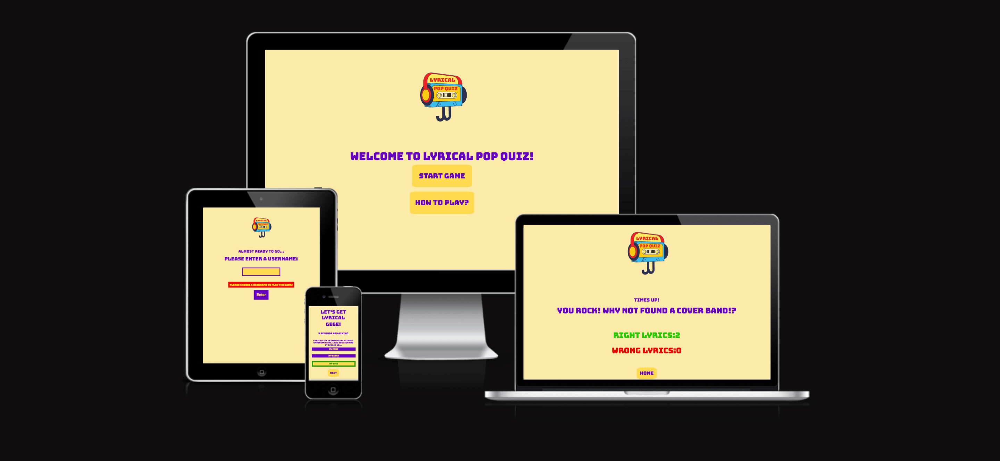

# **Lyrical Pop Quiz**

## **Code Institute Portfolio Project I**

## **Code Institute Portfolio Project II**

## **Background**
I love music and specially singing along to it. No matter if under the shower, in the car or whenever a good lyric just gets me. People around me would probably say I’m quite good with lyrics but when put to a test I can confidently say, this is not the case. Often, we use the words we think are the lyrics but if checked mostly it just sound similar. 
If you want to know how good your lyrical knowledge of popular songs is then this is the perfect game for you! 

## **Contents**
* [Background](#background)
* [Strategy](#strategy)
* [Scope](#scope)
* [User Experience UX](#user-experience-ux)
    * [Target audience](#target-audience)
    * [User Stories](#user-stories)
* [Wireframes](#wireframes)
* [Design Choices](#design-choices)
    * [Color Palette](#color-palette)
    * [Typography](#typography)
* [Features](#features)
    * [Logo](#logo)
    * [Homepage](#homepage)
    * [Rules](#how-to-play)
    * [Username](#username)
    * [Play](#play)
    * [Game](#game)
    * [Results](#results)
    * [Future Features](#future-features)
* [Bugs and Challenges](#bugs-and-challenges)
* [Technologies Used](#technologies-used)
* [Deployment](#deployment)
* [Development](#development)
* [Testing](#testing)
    * [Lighthouse](#lighthouse)
    * [Validation](#validation)

## **Strategy**
Everybody loves singing along to their favorite song but how much of the lyrics do we actually know? In *Lyrical Pop Quiz* everybody can put their lyrical knowledge to the test. 

## **Scope**
The Scope of this project is creating a website with the HTML,CSS and JavaScript framework. The site’s users can play an online quiz to test their specific knowledge of pop song lyrics. The features include creating a username, tracking the score and and a countdown timer. 

## **User Experience UX**

### **Target Audience**

This game is designed for everybody who enjoys pop music and would like to test if they can gues the right lyric. 

### **User Stories**

- As a First Time User
    -	I can see the name and logo of the quiz application.
    - I can find instructions on how to play the game. 
    -	I can see a timer that shows how much time is left to play the game. 
    -	I can see the questions and three answer options.
    -	I can see how many answers I got right or wrong. 

- User Goals 
    -	To be able to play the quiz app on a selected range of device sizes.
    -	To be able to enter a username of my choice. 
    -	To be able to see the remaining time. 
    -	To be able to put my lyrical knowledge to test with help of multiple choice. 

## **Wireframes**

The wireframes where created using Figma.

Homepage:

Section for entering username:

Game play section:

Result section:

How to play page:

## **Design Choices**
### **Color Palette**

The idea behind the color palette was reflecting the mood of a 90's pop art comic with its vibrant and contrasting colors. 

### **Typography**

The Fonts used is [Bungee](https://fonts.google.com/specimen/Bungee) and [Martel](https://fonts.google.com/specimen/Martel). Bungee is a typeface that celebrates the urban sign. Martel is a libre font development project. Bungee being bold and round reminded me of somehting playfull and comic-like. This is why I choose the font. I used Martel on the rules page to make it more readable and underline the less playful information. 

## **Features**

The game application has two pages *Home* and *How to play*. The *Home* page is structured into different sections that are either shown or hidden depending on the user interaction. 
The *How to play* page can only be accessed through the *Home* page which is the landingpage.

### **Logo**

- The logo features a casette with headphones and the games name *Lyrical Pop Quiz*.
- It appears in bright colors to reflect the color-sheme of the application. 
- The logo was created using Canva.com.

### **Homepage**

- In the center top of the page you see the logo with the games name *lyrical Pop Quiz*.
- The two main buttons *Start Game* and *How To Play* are for navigating through the application. 
- Clicking on *Start Game* will hide the landingpage section and show the username-form section. 
- Clicking on the *How To Play* button will open a new window with the rules to the game. 

### **How to play**

- A new page opens with the instructions on how to play the game.
- When *Play now* on the bottom of the poge is clicked it brings you back to the landingpage. 

### **Username**

- When *Start Game* is clicked the landingpage section is hidden and a form to enter the username appears. 
- A username is required and if no username is provided an error-box is shown after pressing *Enter*.
- If username is successfully entered and *Enter* is clicked username-form section is hidden and main-game section will be shown. 

### **Play**

- Entered *Username* will be displayed in message ontop of *Play* button. 
- *Play* button shows the timer and the game. 

### **Game**

- The *timer* that counts down 45 seconds is shown under the message with the *username*.
- The lyrics is shown and has to be completed with one of the three answer options 
- If the correct answer is choosen the answer is highlighted green if the wrong answer was selected its highlighted red.
- The correct and incorrect answers are being counted in the background and will be displayed after the time has run up. 
- After selecting an answer the *Next* button appears to be able to got to the next question. 

### **Results**

- After the timer has run up the *Result* page is shown. 
- Depending on the right and wrong lyrics choosen it displays a *message* for the user. 
- The amount of all *right* and *wrong* answers will be shown. 
- The *Home* button will bring you back to the landingpage. 

### **Future Features**

- Implement a shuffle function that shuffles randomly through the given lyrics. 
- Implement different levels with less time.

## **Bugs and Challenges**
My biggest challenge and bug was displaying the lyrics which represent the questions of the quiz. I first approached this by looping through the array of options (questions.js). The problem here was that it looped through the lyrics-questions array, which was shown in the console, but it only displayed the last option of lyric-question in the main game section. 
I changed my approach and worked with currentQuesition = 0 and using this as my index for each lyrics-option. The first lyric-question starts with the index [currentQuestion], which is 0 and by clicking on the next button it increments the index by one. This made it possible to display all the lyrics-questions after each other. 

## **Technologies Used**

### **Languages**
The languages used to create this website were HTML, CSS and JavaScript.

### **Frameworks & Tools**
* Figma was used for creating the wireframes. 
* GitHub and Git were used as host plattform and version control.
* Codeanywhere as IDE for writing and editing code.
* Google Dev Tools were used to test features and support with the responsiveness and styling of the website.
* [Canva](#https://www.canva.com/create/logos/) was used to create the Logo. 
* [Coolors](#https://coolors.co/) was used to create the color palette.
* [Am I Responsive](#https://ui.dev/amiresponsive) was used to display the website on a range of devices.

## **Deployment**
This site was developed in the [Codeanywhere](https://app.codeanywhere.com/) IDE and deployed to GitHub Pages. During development the site was previewed in the browser through *Port 8000* in Codeanywhere by running the command `python3 -m http.server` in the terminal.

### Deploying to Github Pages:
1. Once logged or signed into Github, find the repository to the project.
2. Search for the *Settings* link and then click it.
3. A navigation bar will open on the left. Search for the *Pages* link and click it. 
4. In the *Source* section, choose *Deploy from a branch*.
5. Under this section you will find *Branch*. Choose *Main* and *Root*.
6. Click *Save* and your Github Pages site will be build. 
7. Refresh the page to see the URL the site is deployed to. 

You can find the deployed site [here](https://maximiliane-k.github.io/lyrical-pop-quiz/).

## **Development**
For local development the project repository can be found on GitHub.
-	Log in or sign up to Github.
-	Navigate to my GitHub profil, [Maximiliane-K](https://github.com/Maximiliane-K.).
-	Locate the repository named *“Lyrical Pop Quiz”*.
-	Click on the green *code* button and choose HTTPS, SSH or GitHubCLI and copy the preferred link. 
-	Open the IDE of your choice and create a directory where the repository should be stored using the terminal. 
-	Enter `git clone`, paste the copied URL and press enter.
-	The repository will be cloned to the selected repository. 

## **Testing**

### **Lighthouse**
To test the performance, accessibility, best practices and SEO of the website, the Google developer tool Lighthouse was used. 

* 
* 

### **Validation**
**W3C Validator**

* [index.html](https://validator.w3.org/nu/?showsource=yes&doc=https%3A%2F%2Fmaximiliane-k.github.io%2Flyrical-pop-quiz%2F) - no errors found

 

